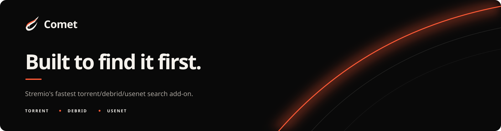

<p align="center">
  
</p>

<p align="center">
  <a href="https://discord.com/invite/UJEqpT42nb"></a>
  <a href="https://stremio-addons.net/addons/comet"></a>
  <a href="kodi/README.md"></a>
</p>

# Features
- **CometNet**: Decentralized P2P network for automatic torrent metadata sharing ([documentation](docs/cometnet/README.md))
- **Kodi Support**: Dedicated official add-on with automatic updates ([documentation](kodi/README.md))
- **Torznab Support**: Official Prowlarr, Sonarr, Radarr, and Jackett integration ([documentation](docs/integrations/torznab.md))
- **Usenet Support**: Search and stream Usenet releases directly in Stremio
  with Newznab/NZBHydra2/Prowlarr, Easynews, AnimeTosho, TorBox Usenet,
  NzbDAV, AltMount, StremThru Newz, compatible add-ons, or a personal NNTP server
  ([configuration guide](docs/beginner/02-configure-and-install-stremio.md#optional-configure-usenet))
- Proxy Debrid Streams to allow simultaneous use on multiple IPs!
- IP-Based Max Connection Limit
- Administration Dashboard with Bandwidth Manager, Metrics and more...
- Production-ready [Prometheus and Grafana observability](docs/advanced/07-observability.md)
- Supported Scrapers: Jackett, Prowlarr, Torrentio, Zilean, MediaFusion, Debridio, StremThru, AIOStreams, Comet, Jackettio, Nyaa, AnimeTosho, NekoBT, BitMagnet, TorrentsDB, Peerflix, DMM and SeaDex
- Caching system ft. SQLite / PostgreSQL
- Blazing Fast Background Scraper
- Debrid Account Scraper: Scrape torrents directly from your debrid account library
- [DMM](https://github.com/debridmediamanager/hashlists) Ingester: Automatically download and index Debrid Media Manager hashlists
- Smart Torrent Ranking powered by [TPR](https://github.com/g0ldyy/torrent-parse-rank)
- Proxy support to bypass debrid restrictions
- Real-Debrid, All-Debrid, Premiumize, TorBox, Debrid-Link, Debrider, EasyDebrid, OffCloud and PikPak supported
- Direct Torrent supported
- [Kitsu](https://kitsu.io/) support (anime)
- Adult Content Filter
- ChillLink Protocol support

# Installation
To customize your Comet experience to suit your needs, please first take a look at all the [environment variables](https://github.com/g0ldyy/comet/blob/main/.env-sample)!

## Self Hosted
### From source (developers)
- Clone the repository and enter the folder
    ```sh
    git clone https://github.com/g0ldyy/comet
    cd comet
    ```
- Install dependencies
    ```sh
    pip install uv
    uv sync
    ````
- Start Comet
    ```sh
    uv run python -m comet.main
    ````
- Develop the backend and Vite frontend together
    ```sh
    cd frontend && npm ci && cd ..
    uv run python scripts/dev_frontend.py
    ```
    Open `http://127.0.0.1:5173`; Vite forwards API requests to Comet on port
    `8000`.

### Docker / production-style setup

Use the dedicated documentation:

- Beginner step-by-step: [docs/beginner/01-get-started-docker.md](docs/beginner/01-get-started-docker.md)
- Full documentation index: [docs/README.md](docs/README.md)

# CometNet (P2P Network)
Comet transforms your Comet instance from an isolated scraper into a participant in a collaborative network. Instead of each instance independently discovering the same torrents, CometNet allows instances to share their discovered **metadata** (hashes, titles, etc.) with each other in a decentralized way. **No actual files are shared.**

Key benefits:
- **Improved Coverage**: Receive torrent metadata discovered by other nodes.
- **Reduced Load**: Less redundant scraping across the network.
- **Trust Pools**: Optional closed groups for trusted metadata sharing.

For more information on how to setup and configure CometNet, please refer to the [CometNet Documentation](docs/cometnet/README.md).

## Support the Project
Comet is a community-driven project, and your support helps it grow! 🚀

- ❤️ **Donate** via [GitHub Sponsors](https://github.com/sponsors/g0ldyy) or [Ko-fi](https://ko-fi.com/g0ldyy) to support development
- ⭐ **Star the repository** here on GitHub
- ⭐ **Star the add-on** on [stremio-addons.net](https://stremio-addons.net/addons/comet)
- 🐛 **Contribute** by reporting issues, suggesting features, or submitting PRs

## License

Comet is licensed under the GNU Affero General Public License v3.0 only.
See [LICENSE](LICENSE).